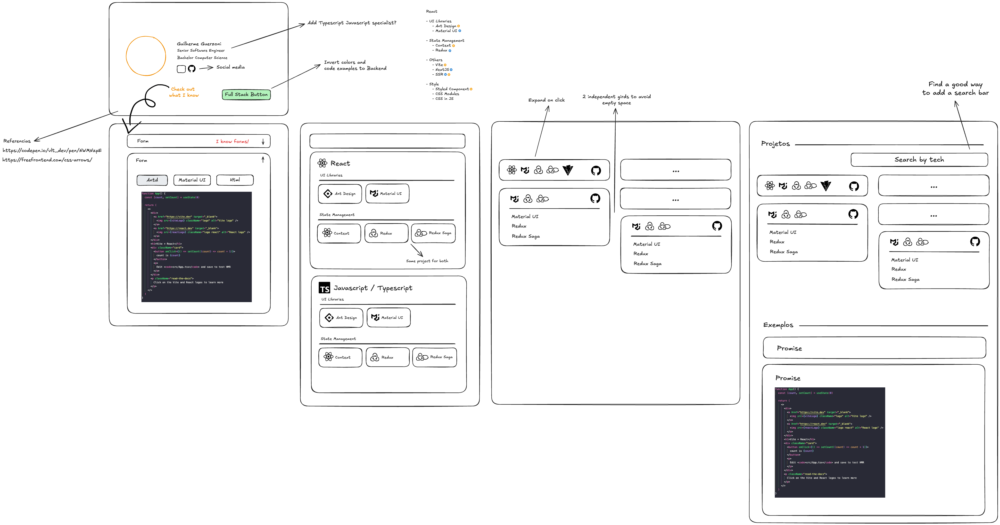
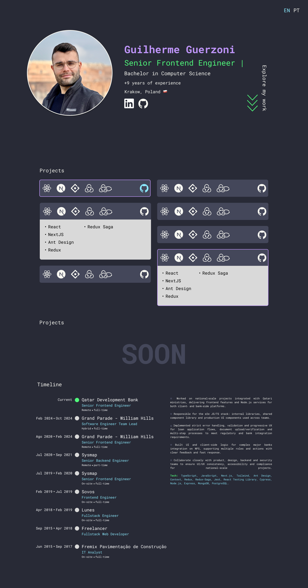

# Personal Website

A modern, accessible personal website showcasing professional experience and technical expertise.

Live version: https://guerzoni.dev

## Design Process

I started by sketching a wireframe using Excalidraw as a handy tool to quickly explore different layout ideas and user flows. After discarding some options and settling on a concept, I jumped into Figma to create a mock version to see how this would actually look with real colors, typography, and spacing.

### Wireframe

Initial wireframe created in Excalidraw:



### Figma Design

Mock created in Figma:

During implementation, I experimented with different ideas. Some worked, some didn't, and the design evolved as I built it.



## Features

- My public projects listing
- Professional experience timeline with interactive job selection
- Typing animation effect for dynamic title display
- Internationalization support (English and Portuguese)
- Fully accessible design following WCAG guidelines
- Responsive design for all screen sizes
- SEO optimized with comprehensive metadata

## Technologies

- Next.js 15.5.4 with App Router and Turbopack
- React 19.1.0
- TypeScript 5
- Tailwind CSS 4
- next-intl for internationalization
- Vercel Analytics
- Husky with pre-commit checks

## Getting Started

Install dependencies:

```bash
npm install
```

Run the development server:

```bash
npm run dev
```

The application will start on http://localhost:3005.

Build for production:

```bash
npm run build
npm start
```

## Available Scripts

- `npm run dev` - Start development server
- `npm run build` - Create production build
- `npm run start` - Start production server
- `npm run lint` - Run ESLint
- `npm run format` - Format code with Prettier
- `npm run type-check` - Type-check TypeScript

## Author

Guilherme Guerzoni

Website: https://guerzoni.dev

GitHub: https://github.com/g-guerzoni
